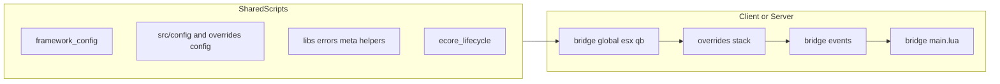

# e_core

## What is it?

**e_core** is a **FiveM resource** and a standalone **core platform**: not only internal glue, but a **documented, versioned surface** for other scripts. The goal is a thoughtful architecture for **reliability**, **ease of use**, and **adoption** (public, free distribution on GitHub).

**Stack:** Lua **5.4** / FiveM natives; **ox_lib** and **oxmysql** dependencies; NUI built with **Svelte 5** (Runes: `$state`, `$derived`) and **TypeScript**, shipped as a static build.

**Goal:** **Consistent behaviour** alongside ESX and QBCore / QBox: same concepts (player, item, notification, progress), same call patterns where possible, **framework-agnostic** at the contract layer.

**Principle (e_core first):** the public **contract** (what you can call, what errors mean, how startup works) is defined **in e_core first**; consumers align to it. Profession / meta / registry style data is typically **owned by e_core**, not a parallel “second source of truth” in consumers. See [docs/PUBLIC_API_HU.md](docs/PUBLIC_API_HU.md) (API is Hungarian-indexed but export names are canonical), [docs/EXTENSION_CONTRACT_HU.md](docs/EXTENSION_CONTRACT_HU.md), [docs/INDEX_HU.md](docs/INDEX_HU.md).

---

## What does it include?

- **`src/bridge/`** – ESX / QB / global adapters; framework selection via config (see **Bridge** below).
- **`overrides/`** – per-stack customisation (inventory, notify, progressbar, …): keep local changes here across upgrades, not by forking `src/`.
- **`src/config/`** – global settings and level profiles (`main.lua`, `levels.lua`).
- **Other resources:** typically bootstrap via `exports['e_core']:getCore()` and documented exports; optional `full_import` (see **Loading and memory**).
- **Proficiency + labor + learned recipes** and **meta** storage; **oxmysql** schema migrations.
- **Central HUD positioning:** consumers can register HUD elements; e_core moves and persists positions (`registerHudElement` and related API).
- **GroupAccess:** whitelist / blacklist by job / gang and grade ([src/libs/group_access.lua](src/libs/group_access.lua)).
- **Errors and auditability:** structured `eCoreErr` table + file-backed event log writer ([src/libs/file_event_logger.lua](src/libs/file_event_logger.lua), [docs/ECORE_ERR_HIBA_NYOMON_HU.md](docs/ECORE_ERR_HIBA_NYOMON_HU.md)).
- **i18n:** locale files + `translate` / `translateU` on the public `eCore` facade.
- **Client–server:** **ox_lib** callback patterns; NUI / UX: modal, notification, progress, form; grid snapping, presets, export/import.
- **Discord log** helper on the server when the `createDiscordLog` hook is available.
- **Profession registry** admin: CRUD, delete dry-run/apply, cleanup jobs, audit lists.
- **Level profile** admin API.
- **Diagnostics** admin: list tests, run, fetch/cancel runs.
- **Labor quote** – quoting / time-estimate path for labor.
- **Item convert pipeline** + console/diagnostic sinks.
- **Integrity check** on client and server.
- **Admin denied audit:** track/purge denied admin calls.
- **NUI admin and diagnostics bridge** for operator/dev tooling.
- **Usable item** hook (`src/standalone/usableitem.lua`).
- **Central DB migrations**; export: `getDbSchemaVersion`.
- **Dev-only:** with `setr e_core_dev true`, `getInternal()` exists – **not** a production contract.

**Ideas / roadmap (not necessarily implemented):** log viewer; AccessGate extensions (level, hasItem); planned 3D object placer with gizmo / keyboard controls.

---

## Bridge: how it works

The **`src/bridge/`** layer establishes shared state and adapters: which legacy core is active (`FRAMEWORK`, `ESX_CORE` / `QB_CORE`), where **`Config`** lives, and how ESX/QB **shared**, **client/server**, and **events** modules wire up.

- **`framework_config.lua`** + **`framework_resource_registry.lua`:** startup mode. ConVars: **`setr e_core:framework "auto"`** | **`"esx"`** | **`"qb"`**; optional **`e_core:framework_resource`** for a custom legacy core resource name (only when not `auto`). If both cores run with `auto`, e_core enters a **controlled IDLE** state (`_ECORE_INIT_FAILED`) without calling `error()` on the whole server—consumers should wait on `exports.e_core:isReady()` / readiness signals.
- **`overrides/**/(shared|client|server).lua`** loads **after** bridge modules but **before** core `src/runtime/**` modules in [`fxmanifest.lua`](fxmanifest.lua), so stack-specific code can extend or override behaviour without copying `src/bridge/` into your fork.

**Consumer entrypoint:** [`src/bridge/main.lua`](src/bridge/main.lua) registers QB/ESX net events, assembles the **`eCore`** facade (`eCoreLifecycle_buildPublicAPI`: e.g. `framework`, `config`, `i18n`, `util`; on server optionally `log.discord`), and exports **`getCore()`**, **`getFrameWork()`**, **`getHelperBase()`**, **`getHelperEcore()`**, among others.

**Contract:** do not read **`_eCoreInternal`** from consumer code; use **`exports['e_core']:getCore()`** (or the documented `@e_core/.../core.lua` import).



---

## Loading, memory, and consumer import

**e_core resource:** FiveM loads every `shared_scripts` entry, then the full `client_scripts` / `server_scripts` lists from `fxmanifest.lua` as **one resource**. This is **not** a lazy module system: there is no built-in partial unload; Lua chunks and tables stay resident while `e_core` runs.

**NUI:** `fxmanifest.lua` **`ui_page`** selects the shell. **Prod:** `src/web/dist/index.html` + `npm run build`. **Dev (Vite HMR):** `http://127.0.0.1:5173/` + run `npm run dev` under `src/web` on the same machine; see [src/web/README.md](src/web/README.md). Lua talks to it via NUI bridge files (`ecore_nui.lua`, `web.lua`, admin/diagnostics bridges).

**Consumer – two common patterns:**

| Pattern | What happens | Memory / cost |
|--------|----------------|---------------|
| **Minimal** | Manifest: `shared_script '@e_core/src/imports/sdk/shared/core.lua'` → `eCore = exports.e_core:getCore()` | Does **not** copy e_core’s full Lua into the consumer; references tables/functions already loaded inside `e_core`. |
| **Full import** | Manifest: `shared_script '@e_core/src/imports/sdk/shared/full_import.lua'` → `LoadResourceFile('e_core', …)` + `load(..., _G)` for several files | Those chunks **execute again** in the consumer’s `_G`; the `e_core` resource **still** stays fully loaded. This does **not** shrink e_core’s own footprint; it trades a uniform bootstrap for extra consumer startup work. |

Paths loaded via `full_import` must be listed in e_core’s **`files { }`** (currently includes `src/imports/sdk/shared/*.lua` among others), otherwise `LoadResourceFile` returns empty.

**Readiness:** `exports.e_core:isReady()` (0.1.7+: always a **boolean**—`false` at startup / while loading / on timeout / in IDLE; `true` only when the item registry is ready); on the client, also wait for item registry / init where applicable—not only that `getCore()` exists.

---

## Operations

**Start order:** legacy core (`es_extended` or `qb-core`) → **`ensure e_core`** → dependent scripts.

If **both** cores run with `auto`: controlled IDLE + log message; force branch with `setr e_core:framework "esx"` or `"qb"`. Details: [docs/FRAMEWORK_CONFIG_REFACTOR_TERVEZES_HU.md](docs/FRAMEWORK_CONFIG_REFACTOR_TERVEZES_HU.md), [docs/FRAMEWORK_IDLE_GUARD_STRATEGY_HU.md](docs/FRAMEWORK_IDLE_GUARD_STRATEGY_HU.md).

```
# ECO SCRIPTS
ensure e_core
ensure eco_crafting
```

**IMPORTANT:** keep customisations in **`overrides/`** so updates do not overwrite your work. Override bridge behaviour **only** there (per-stack `shared.lua` / `client.lua` / `server.lua` + `config.lua`).

**Config:** global – `src/config/`; stack/inventory – `overrides/<stack>/config.lua` (e.g. `overrides/ox_inventory/config.lua`).

Stock ESX/QB or **ox_inventory** often needs no extra edits; other inventories: pick the right override tier in [docs/SUPPORTED_STACK_MATRIX_HU.md](docs/SUPPORTED_STACK_MATRIX_HU.md).

---

## Simplified folder layout

```
e_core/
  fxmanifest.lua          # load order, deps, files{} (imports + NUI dist)
  src/
    bridge/               # framework adapters and lifecycle (esx/, qb/, global/, events/, main.lua)
    runtime/              # domain modules (bootstrap, db, hud, labor, meta, professions, diagnostics, admin, web_bridge, integrity, exports)
    libs/                 # shared Lua libs (helpers, errors, GroupAccess, meta, file logger, itemconvert, profession levels)
    imports/              # consumer entrypoints/helpers (shared/, client/, server/)
    locales/              # translations
    config/               # global config + levels (main.lua, levels.lua)
    standalone/           # standalone hooks (usableitem.lua)
    web/                  # Svelte + TS NUI sources (npm run build → dist)
    web/dist/             # build output (ui_page points here)
  overrides/              # per-stack Lua + config (inventory, notify, …)
  docs/                   # canonical internal contract + ops docs (not runtime) — start: INDEX_HU.md
  types/                  # LuaLS stubs
  scripts/                # CI / dev helpers
```

For NUI / Svelte work: **`src/web/`**, then build → **`src/web/dist/`**.

---

## SDK surface

Inventory exports (addItem, removeItem, …), message systems (sendNotify, drawText, hideText, progressbar), and other core hooks—see `export_examples_*.md` in the repo and `overrides/` samples.

---

## For developers / AI and Cursor context

When starting a new chat or refactor, link or attach:

- [docs/INDEX_HU.md](docs/INDEX_HU.md) – documentation map (**start here**)
- [docs/PROJECT_STRUCTURE.txt](docs/PROJECT_STRUCTURE.txt) – folder roles and file tree
- [docs/PUBLIC_API_HU.md](docs/PUBLIC_API_HU.md) – public `exports.e_core:*` + `eCore:` contract
- [docs/AI_SUPPORT_REFERENCE_HU.txt](docs/AI_SUPPORT_REFERENCE_HU.txt) – deep reference (Hungarian) + FAQ
- [docs/SUPPORTED_STACK_MATRIX_HU.md](docs/SUPPORTED_STACK_MATRIX_HU.md) – supported stack tiers / overrides
- [docs/SZERVER_OPERATOR_CHECKLIST_HU.md](docs/SZERVER_OPERATOR_CHECKLIST_HU.md) – server operator checklist (Hungarian)
- [docs/DB_MIGRATIONS_HU.md](docs/DB_MIGRATIONS_HU.md) – MySQL migrations, `e_core_migrations`, `getDbSchemaVersion` (Hungarian)
- [docs/LUA_LS_AND_CI_HU.md](docs/LUA_LS_AND_CI_HU.md) – LuaLS, luacheck, GitHub Actions (Hungarian)

### Example: message override

```lua
    function eCore:sendMessage(message, mType, mSec) -- src/bridge/esx/client.lua

        ESX.ShowNotification(message, mSec, mType)
    end

    --- OVERRIDE in the 'overrides/...' folder:
    
    function eCore:sendMessage(message, mType, mSec) -- overrides/core/client.lua

        EXAMPLE.MyOwnNotify(message, mSec, mType)
    end
```

### Example: inventory override

```lua
    function eCore:removeItem(xPlayer, item, count, metadata, slot) -- src/bridge/esx/server.lua
    
        xPlayer.removeInventoryItem(item, count, metadata, slot)
    end

    --- OVERRIDE in the 'overrides/...' folder:
    
    function eCore:removeItem(xPlayer, item, count, metadata, slot) -- overrides/avp_grid_inventory/server.lua
    
        return exports["avp_grid_inventory"]:RemoveItemBy(xPlayer.source, count, item)
    end
```

---

## Labor and skill system

The design follows an ArcheAge-style pattern: actions spend **labor** and raise **skills** (proficiency / meta).

Example: harvesting might cost 5 labor and increase harvesting skill; later, rank/discount profiles can reduce labor or speed up work.

Crafting can gate recipes by skill and attach labor costs per craft.

Export samples: [export_examples_server.md](export_examples_server.md), [export_examples_client.md](export_examples_client.md).

e_core uses ESX and QBCore details through the bridge layer.
