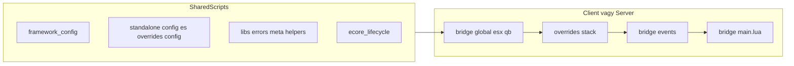

# e_core

## Mire való?

Az **e_core** egy **FiveM resource**, önálló **core platform**: nem csak „belül használt ragasztó”, hanem **dokumentált, verziózható felület** más szkripteknek. Cél a jól átgondolt felépítés a **megbízhatóság**, **könnyű használhatóság** és a **népszerűség** érdekében (publikus, ingyenes terjesztés GitHub-on).

**Környezet:** Lua **5.4** / FiveM natives; **ox_lib** és **oxmysql** függőség; NUI felület **Svelte 5** (Runes: `$state`, `$derived`) és **TypeScript** forrással, buildelt kimenettel.

**Cél:** ESX és QBCore / QBox mellett **egységes viselkedés**: ugyanazok a fogalmak (pl. játékos, item, értesítés, progress), ugyanazok a hívási minták, ahol lehet, **keretrendszer-függetlenül**.

**Alapelv (e_core first):** a közös **szerződés** (mit lehet hívni, mit jelent a hiba, hogyan indul) **előbb** az e_core-ban rögzül, a consumerek ehhez igazodnak. Profession / meta / registry jellegű dolgok forrása tipikusan az **e_core**, nem párhuzamos „második igazság” a consumerben. Részletek: [docs/PUBLIC_API_HU.md](docs/PUBLIC_API_HU.md), [docs/EXTENSION_CONTRACT_HU.md](docs/EXTENSION_CONTRACT_HU.md), [docs/INDEX_HU.md](docs/INDEX_HU.md).

---

## Mit tartalmaz?

- **`src/bridge/`** – ESX / QB / globális illesztés; keretrendszer-választás konfiggal (lásd lent: Bridge).
- **`overrides/`** – stack szerinti testreszabás (inventory, notify, progressbar stb.): frissítéskor ide kerül a helyi módosítás, nem a core fájlok másolgatása.
- **`src/standalone/config/`** – globális beállítások és level profilok.
- **Más resource belépés:** tipikusan import / bootstrap: `exports['e_core']:getCore()` és a dokumentált exportok; opcionálisan `full_import` (lásd: Betöltés és memória).
- **Proficiency + labor + tudás** (megtanult receptek) és **meta** tárolás; **oxmysql** séma migrációk.
- **Központi HUD pozicionálás:** a consumer szkriptek regisztrálhatják a HUD elemeiket, az e_core mozgatja és tárolja a pozícióikat (`registerHudElement` / kapcsolódó API).
- **Whitelist / blacklist AccessGate** job / gang és grade alapon ([src/libs/GroupAccess.lua](src/libs/GroupAccess.lua)).
- **Hibák:** strukturált `eCoreErr`, fájlba író eseménynaplózás ([docs/ECORE_ERR_HIBA_NYOMON_HU.md](docs/ECORE_ERR_HIBA_NYOMON_HU.md)).
- **Fordítás:** locale fájlok + translate / translateU a publikus `eCore` felületen.
- **Kliens–szerver:** **ox_lib** callback minták; NUI / UX: modal, notification, progress, form; grid snapping, preset mentés, export / import.
- **Discord log** osztály (szerver, ha elérhető a `createDiscordLog` hook).
- **Profession registry** admin: CRUD, törlés dry-run / apply, cleanup job, audit lista.
- **Level profile** admin API.
- **Diagnostics** admin: tesztek listázása, futtatás, futás lekérdezés / megszakítás.
- **Labor quote** – árajánlat / időbecslés vonal a laborhoz.
- **Item convert pipeline** + konzol / diagnosztika sink.
- **Integrity check** kliens és szerver oldalon.
- **Admin API denied audit** – elutasított admin hívások nyomon követése / törlése.
- **NUI admin és diagnostics bridge** – operátori / fejlesztői felület felé.
- **Usable item** hook (`src/standalone/usableitem.lua`).
- **DB migrációk** központilag; export: `getDbSchemaVersion`.
- **Dev-only:** `setr e_core_dev true` mellett `getInternal()` – **nem** production szerződés.

**További ötletek / roadmap (nem feltétlenül implementált):** log viewer; AccessGate bővítés (level, hasItem); tervezett 3D object placer választható gizmo / billentyűzet vezérléssel.

---

## Bridge: hogyan működik?

A **`src/bridge/`** réteg állítja elő a közös állapotot és illesztést: melyik legacy core fut (`FRAMEWORK`, `ESX_CORE` / `QB_CORE`), hol a **`Config`**, és hogyan kapcsolódnak az ESX/QB **shared**, **client/server** és **events** modulok.

- **`framework_config.lua`** + **`framework_resource_registry.lua`:** indulási mód. ConVarok: **`setr e_core:framework "auto"`** | **`"esx"`** | **`"qb"`**; opcionálisan **`e_core:framework_resource`** egyedi legacy core resource névhez (csak ha nem `auto`). Ha két core fut egyszerre és `auto` van, az e_core **kontrollált IDLE** állapotba kerül (`_ECORE_INIT_FAILED`), nem `error()`-ral állítja le a szervert – a consumereknek érdemes `exports.e_core:isReady()` / kész jelre várni.
- Az **`overrides/**/(shared|client|server).lua`** a [`fxmanifest.lua`](fxmanifest.lua) szerint a bridge modulok **után**, de a saját **`src/client/*` / `src/server/*`** runtime **előtt** töltődik – így a stack-specifikus kód kiegészítheti vagy felülírhatja a viselkedést anélkül, hogy a `src/bridge/` fájlokat forkolnád.

**Végpont a consumereknek:** a [`src/bridge/main.lua`](src/bridge/main.lua) regisztrálja a QB/ESX net eseményeket, összerakja az **`eCore`** felületet (`eCoreLifecycle_buildPublicAPI`: pl. `framework`, `config`, `i18n`, `util`; szerveren opcionálisan `log.discord`), és exportálja többek között: **`getCore()`**, **`getFrameWork()`**, **`getHelperBase()`**, **`getHelperEcore()`**.

**Szerződés:** más resource **ne** olvassa a **`_eCoreInternal`** belső táblát; használd **`exports['e_core']:getCore()`** (vagy a dokumentált `@e_core/.../core.lua` importot).



---

## Betöltés, memória és consumer import

**e_core resource:** a FiveM a `fxmanifest.lua` alapján **egyben** betölti az összes felsorolt `shared_scripts`, majd kontextus szerint a teljes `client_scripts` / `server_scripts` listát. Ez **nem lazy modulrendszer**: nincs beépített dinamikus „leválasztás”; a chunkok és táblák memóriában maradnak, amíg az `e_core` fut.

**NUI:** `ui_page 'src/web/dist/index.html'` – a futó felület a **buildelt** `src/web/dist/` (forrás: `src/web/`, lásd [src/web/README.md](src/web/README.md)). A Lua oldal NUI bridge fájlokon keresztül kommunikál (`ecore_nui.lua`, `web.lua`, admin/diagnostics bridge).

**Consumer – két tipikus minta:**

| Minta | Mi történik | Memória / költség |
|--------|----------------|-------------------|
| **Minimális** | Manifest: `shared_script '@e_core/src/imports/shared/core.lua'` → `eCore = exports.e_core:getCore()` | Nem másolja be az e_core teljes Lua kódját a consumerbe; referencia az e_core által már betöltött táblákra. |
| **Teljes import** | `shared_script '@e_core/src/imports/shared/full_import.lua'` → `LoadResourceFile('e_core', …)` + `load(..., _G)` több fájlra | Több chunk **újra lefut** a consumer `_G` környezetében; az e_core resource ettől **ugyanúgy** betöltve marad. Ez **nem** csökkenti az e_core saját memória-lábnyomát; egységes bootstrap árán növelheti a consumer indulási költségét. |

A `full_import` által betöltött pathoknak szerepelniük kell az e_core **`files { }`** listájában (jelenleg többek között `src/imports/shared/*.lua`), különben `LoadResourceFile` üres.

**Üzemkész jel:** `exports.e_core:isReady()`; kliensen az item registry és egyéb init után érdemes erre várni, nem csak a `getCore()` létezésére.

---

## Üzemeltetés

**Indulási sorrend:** legacy core (`es_extended` vagy `qb-core`) → **`ensure e_core`** → rá épülő szkriptek.

Ha **mindkét** core fut és `auto` van: kontrollált IDLE + log üzenet; kényszerítés: `setr e_core:framework "esx"` vagy `"qb"`. Részlet: [docs/FRAMEWORK_CONFIG_REFACTOR_TERVEZES_HU.md](docs/FRAMEWORK_CONFIG_REFACTOR_TERVEZES_HU.md), [docs/FRAMEWORK_IDLE_GUARD_STRATEGY_HU.md](docs/FRAMEWORK_IDLE_GUARD_STRATEGY_HU.md).

```
# ECO SCRIPTS
ensure e_core
ensure eco_crafting
```

**FONTOS:** frissítésbiztonság miatt a testreszabást az **`overrides/`** mappában végezd. A bridge viselkedését is **csak** itt írd felül (stack szerinti `shared.lua` / `client.lua` / `server.lua` + `config.lua`).

**Konfig:** globális – `src/standalone/config/`; stack / inventory – `overrides/<stack>/config.lua` (példa: `overrides/ox_inventory/config.lua`).

Alap szerveren vagy **ox_inventory** mellett gyakran nincs szükség extra módosításra; más inventoryhoz válaszd a megfelelő override tier-t: [docs/SUPPORTED_STACK_MATRIX_HU.md](docs/SUPPORTED_STACK_MATRIX_HU.md).

---

## Egyszerűsített mappaszerkezet

```
e_core/
  fxmanifest.lua          # betöltési sorrend, függőségek, files{} (imports + NUI dist)
  src/
    bridge/               # ESX / QB / global illesztés, framework_config, events, main.lua
    client/               # kliens runtime, NUI bridge Lua, HUD registry, exportok
    server/               # szerver: db, migrációk, labor, meta, profession, diagnostics, exportok
    libs/                 # közös Lua: helper, hibák, GroupAccess, meta, napló, itemconvert, …
    imports/              # más resource: @e_core/... include + LoadResourceFile célok
    locales/              # fordítások
    standalone/config/    # globális config + levels
    web/                    # Svelte + TS NUI FORRÁS (npm run build → dist)
    web/dist/               # build kimenet (ui_page erre mutat)
  overrides/              # stack szerinti Lua + config (inventory, notify, …)
  docs/                     # kanonikus belső szerződés + üzemeltetés (nem futó kód) — belépő: INDEX_HU.md
  types/                    # LuaLS stubok
  scripts/                  # CI / dev segédek
```

Ha NUI-t vagy Svelte-et fejlesztesz: **`src/web/`**, majd build → **`src/web/dist/`**.

---

## SDK-réteg és csatolófelület

- **Inventory** exportok (addItem, removeItem, …), **üzenet** rendszerek (sendNotify, drawText, hideText, progressbar), további core illesztések – példák a repo `export_examples_*.md` fájljaiban és az `overrides/` mintákban.

---

## Fejlesztőknek / AI és Cursor kontextus

Új chatben vagy refaktorálásnál érdemes erre hivatkozni:

- [docs/INDEX_HU.md](docs/INDEX_HU.md) – dokumentáció térkép (**innen indulj**)
- [docs/PROJECT_STRUCTURE.txt](docs/PROJECT_STRUCTURE.txt) – mappák szerepe és fájlfa
- [docs/PUBLIC_API_HU.md](docs/PUBLIC_API_HU.md) – publikus `exports.e_core:*` + `eCore:` szerződés
- [docs/AI_SUPPORT_REFERENCE_HU.txt](docs/AI_SUPPORT_REFERENCE_HU.txt) – mély referencia (magyar) + GYIK
- [docs/SUPPORTED_STACK_MATRIX_HU.md](docs/SUPPORTED_STACK_MATRIX_HU.md) – tier / override mátrix
- [docs/SZERVER_OPERATOR_CHECKLIST_HU.md](docs/SZERVER_OPERATOR_CHECKLIST_HU.md) – szerver üzemeltető: ensure sorrend, kockázatlista, ConVarok
- [docs/DB_MIGRATIONS_HU.md](docs/DB_MIGRATIONS_HU.md) – MySQL migrációk, `e_core_migrations`, `getDbSchemaVersion`
- [docs/LUA_LS_AND_CI_HU.md](docs/LUA_LS_AND_CI_HU.md) – LuaLS, luacheck, GitHub Actions

### Példa: üzenet felülírás

```lua
    function eCore:sendMessage(message, mType, mSec) -- src/bridge/esx/client.lua

        ESX.ShowNotification(message, mSec, mType)
    end

    --- OVERRIDE az 'overrides/...' mappában:
    
    function eCore:sendMessage(message, mType, mSec) -- overrides/core/client.lua

        PELDA.SajatUzenom(message, mSec, mType)
    end
```

### Példa: inventory funkció felülírás

```lua
    function eCore:removeItem(xPlayer, item, count, metadata, slot) -- src/bridge/esx/server.lua
    
        xPlayer.removeInventoryItem(item, count, metadata, slot)
    end

    --- OVERRIDE az 'overrides/...' mappában:
    
    function eCore:removeItem(xPlayer, item, count, metadata, slot) -- overrides/avp_grid_inventory/server.lua
    
        return exports["avp_grid_inventory"]:RemoveItemBy(xPlayer.source, count, item)
    end
```

---

## Labor és skill rendszer

A koncepció az ArcheAge MMORPG mintájára működik. Az egyes feladatok elvégzése munkapontokba (labor) kerül, ami növeli a karakter képességeit (proficiency / meta).

Például egy betakarítás 5 laborpontba kerülhet, és hozzáadódik a betakarítási készséghez; később rang / kedvezmény profil szerint gyorsabb munka vagy kevesebb labor.

A crafting rendszerben beállítható, hogy egy tárgyat csak adott jártasság után lehessen előállítani, és mennyi laborba kerüljön.

Export példák: [export_examples_server.md](export_examples_server.md), [export_examples_client.md](export_examples_client.md).

Az e_core ESX és QBCore részleteket is használ a bridge rétegen keresztül.
