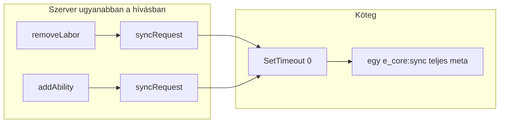

# Labor (munkapont) kezelés – munkafájl (felterképezés)

> Ezt a fájlt a későbbi optimalizálás és refaktor munkához rögzítettük; forrás: `e_core` kódbázis áttekintése.

## Adatmodell és életciklus

- **Tárolás:** `PlayerMetaStore.get(playerId).labor` = `{ val, time }` – a teljes játékos-meta JSON-ként kerül DB-be (`server/db.lua`, `users` / `players` tábla `e_core` oszlop).
- **Betöltés:** `loadMeta` → `prepareMeta` (labor default + NaN/érvénytelen szám védelem) → `addOfflineLabor` → első `e_core:sync` a kliensnek.

**Fájlok:** `server/db.lua` (`loadMeta`), `server/meta.lua` (`prepareMeta`, `syncRequest`).

## Szerver: központi labor logika (`server/labor.lua`)

| Függvény | Szerep |
|----------|--------|
| `getLabor(playerId)` | Olvasás; guard: `systemMode.labor`, playerId, `meta.labor` létezik (`laborPlayerRow`). **Siker: `true`, egyenleg** (a 0 is így jön); **hiba: `false`, `eCoreErr`**. |
| `setLabor(playerId, amount)` | Abszolút beállítás + `syncRequest` |
| `addLabor` / `removeLabor` | Relatív változtatás; limit / érvénytelen összeg ágak |
| `laborIncrease()` | Online automatikus regeneráció: periodikus `SetTimeout`; célok **`GetPlayers()`** + `PlayerMetaStore.get(id).labor` (nem teljes memória-szken); opc. hullám: ConVar **`e_core:labor_tick_chunk`** (0 = mind egyben, >0 = játékos / `SetTimeout(0)` hullám) |
| `addOfflineLabor(playerId)` | Offline idő alapú jóváírás; **nem** hív `syncRequest`-et (a betöltési sync lefedi) |

**Exportok:** `server/exports.lua` – `getLabor`, `setLabor`, `addLabor`, `removeLabor`.

### Külső consumer – `getLabor` ajánlott hívás (e_core **v0.0.41+**)

A korábbi egyetlen visszatéréses (`csak szám`) forma **eltávolítva**: az első érték **mindig** boolean **`ok`**, a második sikernél az egyenleg (szám, **0 is**), hibánál a **`reason`** string (`eCoreErr`).

**Ne** írj olyat, hogy `if exports.e_core:getLabor(src) then` – 0 egyenlegnél régen is téves volt; most az első érték `true`/`false`, nem a pontszám.

**Szerver:**

```lua
local ok, laborOrErr = exports.e_core:getLabor(playerId)
if not ok then
    -- laborOrErr == 'not_found_metadata' | 'the_system_is_turned_off' | …
    return
end
local balance = laborOrErr  -- number
```

**Kliens** (saját játékos cache, `export_examples_client.md`):

```lua
local ok, laborOrErr = exports.e_core:getLabor()
if not ok then return end
local balance = laborOrErr
```

Részletes szerződés: `docs/PUBLIC_API_HU.md` §2–§3 + §5, `export_examples_server.md` / `export_examples_client.md`, `changelog.md` (0.0.41).

**Példa hívás a repóban:** `standalone/usableitem.lua` – `labor_enhancer` → `addLabor`.

## Szinkron és mentés

- **set/add/remove** után: `syncRequest(playerId)` (`server/meta.lua`) – kötegelt `e_core:sync` egy `SetTimeout(0)` tickben (`PlayerMetaStore.queueSync` → burkolt payload, lásd `docs/NET_EVENTS_AUDIT_HU.md`).
- **`laborIncrease`:** tick után **`syncRequest(playerId)`** (ugyanaz a kötegelt útvonal), ha ténylegesen nőtt a labor (`val < laborLimit` ág).

## Kliens és NUI

| Hely | Szerep |
|------|--------|
| `client/main.lua` – `getLabor()` | Cache (`ClientMetaStore.getMeta()`): siker **`true`, labor.val**; labor ki → `false, reason`; nincs még `labor` blokk (sync előtt) → `false, not_found_metadata` |
| `client/exports.lua` | `getLabor` export (kliensen nincs labor írás) |
| `e_core:sync` esemény | Teljes meta; INIT / UPDATE (page vs hud) |
| `src/web/src/lib/LevelPreview.svelte` – `updateHud()` | Labor szám + progress (`model.laborLimit`) |
| `src/web/src/lib/rankData.ts` | `laborLimit` |
| `src/web/dist/index.html` | `#labor_hud_*` |

## Konfiguráció

- `standalone/config/main.lua`: `systemMode.labor`, `displayComponent.laborHud`, `defaultLabor`, `laborLimit`, `laborIncreaseTime`, `laborIncrease`, `laborIncreaseOffline`.
- `libs/config_check.lua`: labor mezők `tonumber` normalizálása.

## Jártasság / labor költség (nem `labor.lua`, de együtt tervezendő)

- `standalone/config/levels.lua`: rangonkénti **`labor` %** (kedvezmény).
- `libs/meta.lua` – `getDiscounts(value)`: a `Config.levels` sorok **numerikus mezőit** interpolálja (köztük `labor`). A tényleges „mennyi laborba kerül egy akció” logika tipikusan **külső szkript** + export / discount.

## Refaktor / optimalizálás fókuszlista

1. ~~**Ismétlődő validáció**~~ – kész: `laborRequireSystem` + `laborPlayerRow` a `server/labor.lua` tetején; `getLabor` / `setLabor` / `addLabor` / `removeLabor` ezekre épül.
2. **`laborIncrease` skálázhatóság:** **kész** – iteráció **online** forrásokon (`GetPlayers` + `hf.isValidPlayerSource` + meta.labor); nagy szerveren opcionálisan `setr e_core:labor_tick_chunk 64` (példa) több frame-re osztja a feldolgozást.
3. ~~**Szinkron egységesítés**~~ – kész: auto tick alatt **`syncRequest(playerId)`** (kötegelt ugyanaz a mechanizmus, mint meta írásnál); közvetlen `TriggerClientEvent` ide nem kell.
4. **`labor.time` viselkedés:** mindkét útvonal **`os.time()`** alapú periódus (`laborIncreaseTime` perc online; offline szorzó `addOfflineLabor`-ban). **Online tick:** `labor.time` mindig frissül; kliens sync csak ha `val < laborLimit` (volt tényleges növelés) – így cap mellett kevesebb hálózat, a szerver `labor.time` ettől még mindig aktuális offline számításhoz. **Betöltés:** `addOfflineLabor` után a meglévő `loadMeta` → `e_core:sync` küldi a kliensnek a frissített sort.
5. ~~**Kliens `getLabor`**~~ – kész: kliens meta cache `labor` hiánya → `false, not_found_metadata`.
6. **API stílus:** szerver továbbra is `(false, reason)` / siker szám vagy `true`; egységes Result típus később (nincs változás).

## Gyors fájlindex

- `server/labor.lua` – labor CRUD, auto / offline növelés  
- `server/meta.lua` – `prepareMeta`, `syncRequest`  
- `server/db.lua` – `loadMeta` + `addOfflineLabor` hívás  
- `server/exports.lua` – labor exportok  
- `client/main.lua`, `client/exports.lua` – kliens olvasás, NUI  
- `fxmanifest.lua` – `server/labor.lua` betöltés

---

## Külső projektek: labor minták (eco_crafting, eco_fishing)

> Forrás: a workspace-hez csatolt `eco_crafting` és `eco_fishing` **szerver** kódjai (a halászatnál a `laborCheck` a `libs/shared/functions.lua`-ban van, de a **szerver callback** hívja).

### eco_crafting – `server/main.lua`

**1) Ellenőrzés előtt:** aktuális labor + jártasság alapú kedvezmény (`getDiscounts`), recept `recipe.labor` mező.

```lua
-- eco_crafting/server/main.lua (részlet)
local currentLabor, proficiency, discounts = 0, 0, {}

if Config.systemMode.labor then
    currentLabor = exports.e_core:getLabor(xPlayer.source)

    if Config.systemMode.profession then
        proficiency = exports.e_core:getAbility(xPlayer.source, 'crafting', recipe.profession)
        discounts = exports.e_core:getDiscounts(proficiency)
    end
end

-- labor check
local labor = tonumber(recipe.labor) or 0

if Config.systemMode.labor and labor and labor > 0 then
    local discount = discounts.labor or 0

    if discount > 0 then
        labor = math.ceil(labor - (labor / 100) * discount)
        labor = labor < 0 and 0 or labor
    end

    if currentLabor < labor then
        -- hiba: not_enough_labor, return false
    end
end
```

**2) Sikeres craft után:** labor levonás, jártasság növelés (költött laborral, ha nincs külön `increaseProficiency`).

```lua
-- eco_crafting/server/main.lua (részlet)
if Config.systemMode.labor and labor > 0 then
    exports.e_core:removeLabor(xPlayer.source, labor)
end

if Config.systemMode.profession then
    if not increaseProficiency then
        if labor > 0 then
            increaseProficiency = labor
        end
    end

    if increaseProficiency and increaseProficiency > 0 then
        exports.e_core:addAbility(xPlayer.source, 'crafting', recipe.profession, increaseProficiency)
    end
end
```

**3) Discord / napló mező:** craft után friss labor kiolvasása.

```lua
-- eco_crafting/server/main.lua (részlet)
if log then
    if Config.systemMode.labor then
        log.putField(translate('labor'), hf.formatNumber(exports.e_core:getLabor(xPlayer.source)), true)
    end
    -- ...
end
```

**Recept oldal (nem szerver, de összetartozik):** `config/recipes.lua` – pl. `labor = 5` mező receptenként.

---

### eco_fishing – `server/main.lua` (callback: `eco_fishing:createCatch`)

**Konfig:** `Config.laborCost.basicCatch` / `.sportCatch` stb. – `reqLabor = tonumber(Config.laborCost[fishingContext.fishingType .. 'Catch'])`.

```lua
-- eco_fishing/server/main.lua (részlet)
local reqLabor = tonumber(Config.laborCost[fishingContext.fishingType .. 'Catch'])

if Config.systemMode.labor and reqLabor and reqLabor > 0 then
    local payableLabor, laborReason = laborCheck(reqLabor, playerId)
    if payableLabor then
        exports.e_core:removeLabor(playerId, payableLabor)
        eCore:sendMessage(playerId, translate('remove_labor', math.floor(payableLabor)), 'info')
    else
        eCore:sendMessage(playerId, localeText(laborReason), 'error')
        return cb({ success = false, osTime = currentTime })
    end

    if Config.systemMode.profession then
        exports.e_core:addAbility(playerId, 'harvesting', 'fishing', payableLabor)
    end
end
```

### eco_fishing – `laborCheck` (shared, szerverről hívva)

**Figyelem:** a kedvezmény számítása **százalék * 0.01** (`getDiscounts(...).labor`), nem ugyanaz a képlet, mint az eco_crafting `labor/100 * discount` írása (eredményben hasonló szintent, de a két projekt **érdemes szinkronban** tartása refaktor célpont lehet).

```lua
-- eco_fishing/libs/shared/functions.lua
function laborCheck(reqLabor, playerId)
    playerId = tonumber(playerId)
    local proficiency, laborDiscounts
    local laborPoints = exports.e_core:getLabor(playerId)

    if Config.systemMode.profession then
        proficiency = playerId and exports.e_core:getAbility(playerId, 'harvesting', 'fishing') or
                exports.e_core:getAbility('harvesting', 'fishing')
        laborDiscounts = exports.e_core:getDiscounts(proficiency).labor or 0
        reqLabor = reqLabor - (reqLabor * laborDiscounts * 0.01)
    end

    if laborPoints < reqLabor then
        return false, 'not_enough_labor'
    end

    return reqLabor
end
```

### eco_fishing – meta regisztráció (szerver helper)

```lua
-- eco_fishing/libs/server/functions.lua
function initMeta(playerId)
    if Config.systemMode.profession then
        exports.e_core:registerMeta(playerId, 'harvesting', { fishing = 0 })
    end
end
```

### Összegzés (minták összehasonlítása)

| Aspektus | eco_crafting (szerver) | eco_fishing (szerver + shared) |
|----------|-------------------------|--------------------------------|
| Labor olvasás | `getLabor(xPlayer.source)` | `getLabor(playerId)` a `laborCheck`-ben |
| Kedvezmény | `discounts.labor` (százalék), `math.ceil(labor - (labor/100)*discount)` | `getDiscounts(proficiency).labor`, `reqLabor - reqLabor * discounts * 0.01` |
| Levonás | `removeLabor(source, labor)` | `removeLabor(playerId, payableLabor)` |
| Jártasság | `addAbility(..., 'crafting', recipe.profession, ...)` | `addAbility(..., 'harvesting', 'fishing', payableLabor)` |
| Gate | `Config.systemMode.labor` + recept `labor` | `Config.systemMode.labor` + `Config.laborCost.*` |

---

## Egy laborba kerülő művelet: teljes folyamat – forgalom és számítás

Itt nem csak a `removeLabor` egy sora számít, hanem az a **végpontok közötti forgatókönyv**, amit egy tipikus resource (crafting, halászat) lefuttat: **előfeltétel + kedvezményes költség + „van elég?” + levonás + jártasság + kijelzés**, valamint mi jár **e_core** nélkül, inventory / callback / notify szinten.

### 1. Ellenőrzés (van elég labor a *kedvezményes* költséghez?)

**Szerveren** (ez a hitelesített út) tipikusan:

| Lépés | e_core / kód | Hálózat | Számítás |
|--------|----------------|---------|----------|
| Alapköltség | recept / config (`labor`, `laborCost.*`) | 0 | `tonumber`, konstans olvasás |
| Jártasság olvasása | `getAbility(playerId, kategória, szakma)` | **0** – memória (`PlayerMetaStore`) | O(1) táblaolvasás |
| Kedvezmény tábla | `getDiscounts(proficiency)` (`libs/meta.lua` + export) | **0** | `Config.levels` bejárás / interpoláció – kis **O(szintek száma)** |
| Ténylegesen fizetendő labor | pl. crafting: `labor - (labor/100)*discounts.labor`; fishing: `reqLabor - reqLabor * laborDiscounts * 0.01` | **0** | pár lebegőpont / `math.ceil` |
| Aktuális egyenleg | `getLabor(playerId)` | **0** – szerveroldali export, nem küld a kliensnek | O(1) olvasás |
| Összehasonlítás | `currentLabor < labor` (vagy `laborCheck` visszaút) | **0** | O(1) |

**Összegzés az ellenőrzésre:** az egész „van elég labor discounttal?” blokk **szerveren belül** fut; **nem** jár vele `e_core:sync`, és **nem** kell külön lekérdezni a klienstől a labor értéket, ha a szerveren már betöltött a meta.

**Kliens oldali előellenőrzés** (pl. `eco_crafting` kliens craft gomb előtt): `getLabor()`, `getAbility`, `getDiscounts` a **kliens exportokkal**, a legutóbbi `e_core:sync`-ből kitöltött **`ClientMetaStore`** meta szerint. Ez is **0** e_core-hálózat, de **csak UX / optimista** ellenőrzés: a szerver újra számol és dönt.

### 2. Ha nincs elég labor (hibaág)

- **e_core:** nincs `removeLabor`, nincs `syncRequest` emiatt.
- **Gyakori plusz:** `eCore:sendMessage`, resource saját `TriggerClientEvent` (pl. craft státusz kliensnek), napló – ezek **külön** hálózati események, nem az e_core meta sync részei.

### 3. Ha van elég: levonás + jártasság (e_core)

| Lépés | Hálózat (e_core) | Megjegyzés |
|--------|------------------|------------|
| `removeLabor(playerId, ténylegesLabor)` | Közvetlenül semmi; utána `syncRequest` | Memória + limit + `os.time()` |
| Ugyanabban a műveletben `addAbility(...)` (craft / fish) | Ugyancsak `syncRequest`; **kötegelve** gyakran **ugyanazzal** a tickkel | Két hívás → egy kötegelt szinkron lehetséges |
| `TriggerClientEvent('e_core:sync', id, envelope)` | **1** (tipikus sikeres craft/fish + jártasság esetén is) | Payload: **`{ v, kind='full', rev, data }`** – `data` = teljes meta (delta később) |
| DB | **0 azonnal** | Mentés külön ütemezés / esemény szerint |

### 4. Kijelzés frissítés (labor HUD / stat lap)

**Kliens `e_core:sync` után** (`client/main.lua`):

- `ClientMetaStore.applyServerSync(payload)` → teljes meta csere a kliensen;
- ha `nuiReady`: **egy** `SendNUIMessage` – `UPDATE`, `subject = 'page'` **vagy** `'hud'` (`IsNuiFocused()` szerint), a **teljes** `metadata`-val.

Tehát egy sikeres laboros művelet végén az e_core + NUI részből: **1** szerver→kliens net esemény + **1** NUI frissítés (ha a NUI már inicializálva van). A labor sáv / szám a `view.js` `updateHud()` / oldal logikán át jelenik meg – további hálózat **nincs** (belső NUI üzenet).

### 5. Amit a laboros művelet *még* hozhat (nem e_core meta sync)

Ezek resource-függők, de egy „craft / halászat egy menetben” képet adnak:

- **Szerver → kliens:** saját események (pl. `eco_crafting:addProductStatus`, `eco_fishing:endOfFishing` hibaágak), **callback válasz** (`cb({ success, … })`) – mindegyik külön üzenet;
- **Inventory bridge:** `removeItem` / `removeItems` – további belső / export hívások és események;
- **Notify:** `eCore:sendMessage` – attól függően, hogyan van felülírva (ESX notify, ox_lib, stb.), plusz egy vagy több kliens esemény.

Ezek **nem** helyettesítik és **nem** összevonhatók automatikusan az `e_core:sync`-szel; a **labor vonal szempontjából** a meta frissítés továbbra is az egy kötegelt `e_core:sync`.

### 6. Rövid összkép táblázat (egy sikeres, laborral terhelt művelet, e_core szempontból)

| Rész | e_core hálózat | e_core számítás (nagyságrend) |
|------|----------------|-------------------------------|
| Előellenőrzés (getLabor + discount + összehasonlítás) | **0** | O(1) + O(szintek) kedvezményhez |
| removeLabor | 0 közvetlen; utána sync köteg | O(1) |
| addAbility (ha van) | ugyanabba a kötegbe futhat | O(1) + esetleg `messageIfLevelChange` |
| `e_core:sync` | **1×** teljes meta | szerializáció + kliens deszerializáció a meta mérettel arányos |
| NUI UPDATE | 0 hálózat (belső) | 1 üzenet, UI újrarajz |

---

## Kanonikus labor-költség számítás

Ez a szakasz **egy közös, dokumentált szabályt** ad: ugyanazt a számot kapjuk előnézetben, ellenőrzéskor és levonáskor, ha minden resource ezt követi. (Jelenleg a `eco_crafting` és `eco_fishing` képlete **matematikailag egyenértékű**, de más írásmódot használ; egy helyen rögzített kanonikus forma csökkenti a szétcsúszást.)

### Szemantika (`Config.levels`, `getDiscounts`)

- A `standalone/config/levels.lua` kommentje szerint a `labor` mező: **„labor cost reduction as a percentage”** – tehát **0–100 közötti százalék**: mennyivel csökken az alap munkapont-költség.
- A `exports.e_core:getDiscounts(proficiencyPoints)` (vagy kliensen ugyanez) a jártasság pontszáma alapján **interpolált** kedvezményt ad vissza; a visszatérési táblában a **`labor` mező = aktuális kedvezmény százalék** (`p`), ugyanabban a jelentésben, mint a `Config.levels` sorokban.

### Kanonikus képlet

Legyen:

- `base` – nem negatív alapköltség (recept `labor`, `Config.laborCost.*`, stb.), szám;
- `p` – kedvezmény százalék: `local p = (discounts.labor or 0)` ahol `discounts = exports.e_core:getDiscounts(proficiency)` és `proficiency` a **releváns** jártasság pont (pl. crafting szakma vagy halászat `harvesting.fishing`).

**Fizetendő (effektív) munkapont** egész értékre kerekítve (javasolt, hogy `removeLabor` és az UI ugyanazt lássa):

```lua
local p = tonumber(discounts.labor) or 0
if p < 0 then p = 0 elseif p > 100 then p = 100 end
local effective = base * (1 - p / 100)
local paidLabor = math.max(0, math.ceil(effective))
```

**Ekvivalens írásmód** (pl. eco_crafting stílusú, ugyanarra a kerekítésre hozva):

```lua
local paidLabor = math.max(0, math.ceil(base - (base / 100) * p))
```

A `eco_fishing` jelenlegi `reqLabor - reqLabor * laborDiscounts * 0.01` ugyanaz, mint `base * (1 - p/100)`, ha `p = laborDiscounts`; a **kerekítés** ott nincs explicit – kanonikusan érdemes a fenti **`math.ceil` + `math.max(0, …)`** szabályt követni, hogy ne legyen tört többlet a levonásnál.

### Honnan jön a `proficiency`?

Resource-specifikus (nem az e_core dönti el):

| Példa | Kategória / név | `getAbility(playerId, …)` |
|--------|------------------|---------------------------|
| eco_crafting | `crafting`, recept `profession` | `getAbility(src, 'crafting', recipe.profession)` |
| eco_fishing | `harvesting`, `fishing` | `getAbility(src, 'harvesting', 'fishing')` |

Ezután: `discounts = getDiscounts(proficiency)` → `p = discounts.labor`.

### Hitelesítés és levonás

1. `paidLabor` számítása a fenti kanon szerint (szerveren).
2. `current = exports.e_core:getLabor(playerId)` – ha `current < paidLabor` → nincs levonás, hiba.
3. Ha rendben: `removeLabor(playerId, paidLabor)` (és ha kell, jártasság: `addAbility` ugyanilyen `paidLabor` értékkel, hogy a költség és a XP növekedés egyezzen).

### Jövőbeli e_core segédfüggvény (opcionális implementáció)

Egyetlen export vagy `libs` függvény formájában például:

`computePaidLabor(baseLabor, proficiencyPoints)` → `{ paidLabor, discounts }`

belsőleg hívja a már létező `getDiscounts(proficiencyPoints)`-ot és a fenti képletet – így a külső resource-ok **nem** másolják a %-logikát.

---

## Miért megy a teljes meta az `e_core:sync`-en?

### Rövid válasz

A két memóriabeli változás (`removeLabor` + `addAbility`) **nem** jelenti automatikusan **két** hálózati szinkront: mindkettő `syncRequest`-et hív (`server/meta.lua`), ami **kötegelve**, ugyanarra a `SetTimeout(0, …)` tickre gyakran **egyetlen** `e_core:sync` üzenetet eredményez (`PlayerMetaStore`). A payload `data` mezője a teljes meta, mert **egy atomi pillanatkép** megy a kliensnek – nem kell külön egyeztetni, mi változott előbb vagy utóbb.



### Miért teljes tömb, nem delta?

1. **Konzisztencia:** A kliens meta cache mindig ugyanazt a táblát látja, mint a szerver `data` mezője az adott pillanatban. Nincs „labor már friss, jártasság még régi” két üzenet közötti ablak.
2. **Egyszerű szerződés:** Egy eseménynév (`e_core:sync`), egy kezelő (`client/main.lua`: teljes csere + NUI `UPDATE` teljes `metadata`-val). Nincs merge logika, nincs mezőszintű verzió.
3. **NUI igény:** A stat lap / HUD a **teljes** meta kontextusát használja; részleges üzenethez a kliensnek és a JS-nek össze kellene fésülnie a részpatch-et a korábbi állapottal (több hibaforrás).
4. **Lua / FiveM:** Mélyen beágyazott táblák delta szinkronja és szerializációja könnyen elcsúszik; **teljes csere** előre jelezhető és könnyen tesztelhető.
5. **Történeti kompromisszum:** Kis meta és ritkább akció mellett a teljes blob **fejlesztői idő és hibák** szempontjából olcsóbb, mint egy jól megtervezett részleges sync – tipikusan „először működjön, skálázás később” irány.

### Hátrány

Nagy meta + sűrű akció esetén az **üzenetméret** (`data` JSON) lesz a szűk keresztmetszet (lásd lentebb a refaktor megjegyzést).

### Összegzés

Nem azért kell a teljes tömb, mert „minden mező mindig változik”, hanem mert **egy olcsó, egyértelmű szinkron-szerződés**: több szerveroldali meta-módosítás **ugyanarra a kötegre** futhat, és a kliens **egyszer** kapja meg a végállapotot. Lényeg: **kötegelés + pillanatkép**, nem „két változás = két külön részleges üzenet”.

### Refaktor-szempont

Ha sok művelet és nagy meta, a **domináns költség** gyakran nem a kedvezmény számítás, hanem a **teljes meta együttes küldése** minden sikeres akció után. Érdemes lehet később **delta / részleges sync** vagy „csak labor + érintett kategória” üzenet, ha a forgalom szűk keresztmetszet lesz (`rev` + envelope már előkészítve).

Utolsó rögzítés: e_core felterképezés + eco_crafting / eco_fishing minták + laboros művelet teljes folyamat + **kanonikus labor-költség** + **miért teljes meta sync** fejezet.
